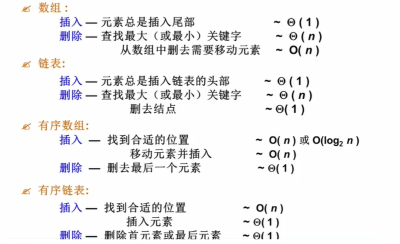
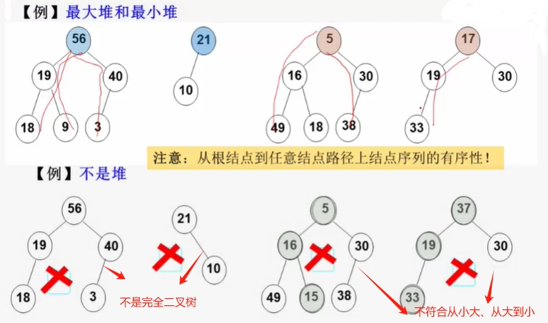
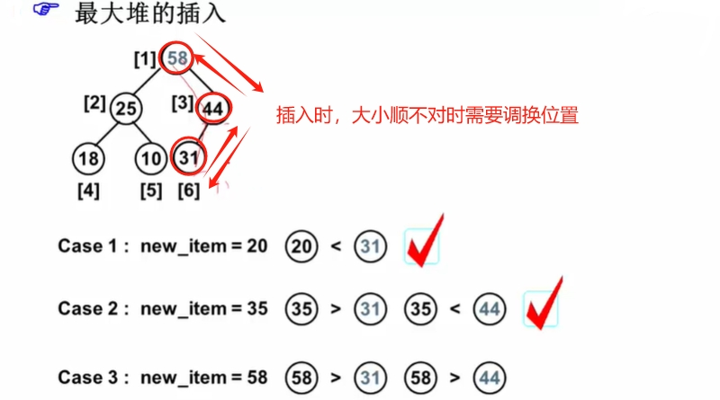
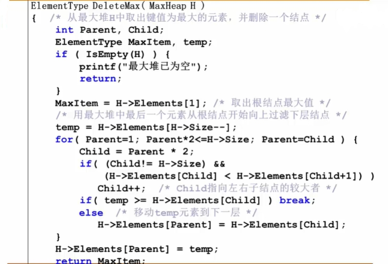

# 什么是堆

`优先队列`（Priority Queue）：它是一种“特殊的队列”，取出元素的顺序是依照元素的`优先权（关键字）`大小，而不是元素进入的队列的先后顺序。

## 堆的实现

使用**数组**、**链表**表示【堆】的时候，在**查找**、**插入**或者**删除**的时候，总有一些操作复杂度不够小。有没有更好的办法呢？--> `二叉搜索树`

**二叉搜索树**表示【堆】：**查找**、**插入**、**删除**操作复杂度与树的高度相关（O(logn)），问题在于，如果每次都删除、或者插入最大的值，几次操作后，会导致二叉搜索树失去平衡，复杂度就上升了。

## 完全二叉树表示【堆】
**完全二叉树**表示【堆】：满足，每个结点的元素值不小（或不大于）于其子结点的元素值。
## 堆的特性

## 堆的抽象数据类型描述

:::info 抽象数据类型描述
类型名称：最大堆（MaxHeap）

数据对象集：完全二叉树，每个结点的元素值不小于其子结点的元素值。

操作集：最大堆H∈MaxHeap，元素item∈ElementType，主要操作有：
> 1. 创建一个空的最大堆。
>
> 2. 判断最大堆H是否已经满。
>
> 3. 将元素item插入最大堆H。
>
> 4. 判断最大推H是否为空。
>
> 5. 返回H中最大元素（高优先级）。
:::

## 最大堆的操作

:::details 初始化

:::

:::details 插入

:::

:::details 删除

:::

:::details 应用创建
**如何使用堆排序？**
建立最大堆：将已经存在的N个元素按照最大堆要求存放在一个一维数组中。

方法1：通过插入操作，将N个元素一个个相续插入到一个初始为空的堆中，其中时间代价最大为O(NlogN)

方法2：在线性时间复杂度下建立最大堆，
> （1）将N个元素按照顺序存入，先满足完全二叉树的结构特性。
>
> （2）再调整各结点位置，以满足最大堆的有序特性。
> > 怎么调整？从倒数第一个开始，从下往上调整
> > 

:::