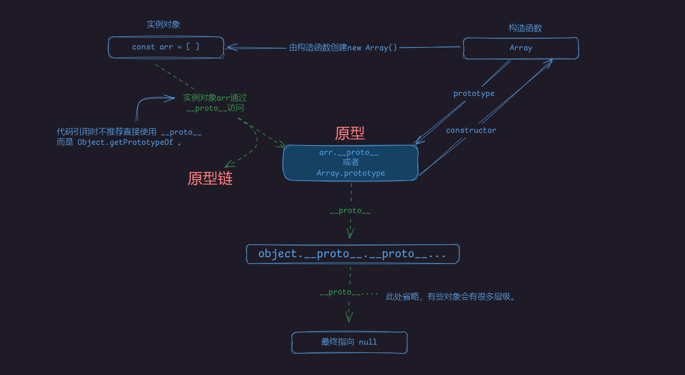

# 原型与原型链

在 JavaScript 中，`原型`和`原型链`是实现`继承`和`共享`属性的基础。

## 原型
每个 JavaScript 对象（除了 null）都有一个关联的对象，称为原型。每个对象从原型继承属性和方法。可以通过`__proto__` 属性访问对象的原型（不推荐直接使用），或者通过 Object.getPrototypeOf 方法来获取。

## 原型链

当试图访问一个对象的属性时，JavaScript 引擎首先会在对象自身的属性中查找。如果找不到，它会继续在对象关联的的原型中查找，这个过程会一直持续下去，直到找到该属性或到达原型链的末尾（null）。这种一层一层的关联关系形成的链我们称之为`原型链`。

## constructor
在 JavaScript 中，constructor 属性指向创建实例对象的构造函数。每个对象都有一个 constructor 属性，这个属性实际上是被当做共享属性放在它们的原型对象中。
- 对象的 `constructor` 属性：指向创建该对象的构造函数。
- 原型对象的 `constructor` 属性：指向关联的构造函数。

## prototype
prototype 属性只存在于函数对象上。在 JavaScript 中，每个函数（包括构造函数）都有一个 prototype 属性。

## proto
在 JavaScript 中，__proto__ 属性是每个对象（除了 null）都有的一个内部属性，用于指向该对象的原型。所有的实例对象都有`__proto__`属性。
- **访问原型**：__proto__ 属性允许你访问和设置对象的原型，但直接使用 __proto__ 并不推荐，因为它是一个非标准的属性。推荐使用 Object.getPrototypeOf 和 Object.setPrototypeOf 方法来获取和设置对象的原型。
- **继承链**：当访问一个对象的属性时，如果该属性在对象自身不存在，JavaScript 引擎会通过 __proto__ 属性在原型链上查找，直到找到该属性或到达原型链的末尾（null）。

## 构造函数
构造函数和普通函数本质上没什么区别，只不过使用了new关键字创建对象的函数，被叫做了构造函数（首字母一般是大写，用以区分普通函数）。

:::info 使用 new 时构造函数内部操作过程
lobal Execution Conte
1. **创建一个新对象**： 
在内存中分配空间并创建一个新的空对象。
2. **设置原型**： 
将新对象的 __proto__ 属性设置为构造函数的 prototype 属性，从而建立新对象与构造函数原型之间的关联。
3. **绑定 this**： 
将构造函数内部的 this 绑定到新创建的对象上，使得构造函数中的 this 指向这个新对象。
4. **执行构造函数内部代码**： 
执行构造函数内部的代码，对新对象进行初始化。
5. **返回新对象**： 
如果构造函数没有显式返回一个对象，则默认返回新创建的对象。如果构造函数显式返回一个对象，则返回该对象。
:::
