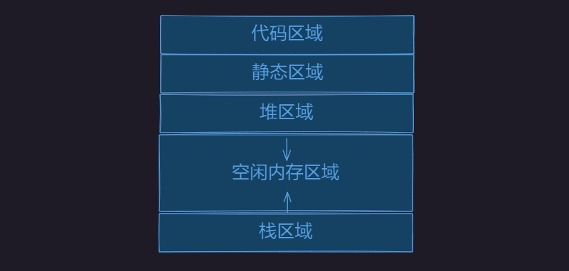

# 内存管理

高级语言程序最终被编译器（解释器）转换成一条条机器指令，程序最终的执行形式是进程，进程为程序提供运行时刻环境（run-time environment），此环境处理许多事务如：为源程序中的对象分配和安排存储位置，过程连接，参数传递，与操作系统、输入输出设备等的接口。

程序在执行前，操作系统需要为该进程分配内存空间，典型的运行时刻内存划分如下：




## JavaScript内存空间

与其他编程语言类似，JavaScript的内存空间同样可分为`栈空间`和`堆空间`：
- JavaScript中那些具有固定大小的基本数据类型（String、Undefined、Null、Boolean、Number、Symbol、Bigint） 存储在栈空间中。
- 对象都分布在堆内存空间中，在栈空间中存储的是存-储于堆空间的对象的引用地址。


## 执行上下文栈
每次当控制器转到可执行代码的时候，就会进入一个执行上下文，JavaScript中的运行环境三种情况：
- 全局环境：JavaScript代码运行起来会首先进入该环境
- 函数环境：当函数被调用执行时，会进入当前函数中执行代码
- eval（不建议使用，可忽略）

代码的一次执行通常会有许多个执行上下文，每次过程（函数）调用都会产生一个新的执行上下文，js中通过调用栈(Call stack)来管理这些执行上下文，栈底永远都是全局上下文，而栈顶就是当前正在执行的上下文。

**每个执行上下文通常有的元素**（来自《编译原理》运行时环境章节）：
| 元素       | 描述                                                                   |
| :--------- | ---------------------------------------------------------------------- |
| 返回值     | 本活动返回给调用过程的值；                                             |
| 实参区域   | 调用过程提供的实参值；                                                 |
| 控制链     | 指向调用过程活动记录的指针，用于本次活动结束时的恢复；                 |
| 存取链     | 指向直接外围过程的最近一次活动的活动记录指针，用于对非局部名字的访问； |
| 机器状态域 | 保存断点的现场信息、寄存器、PSW等；                                    |
| 局部数据区 | 在本次活动中，为过程中定义的局部变量分配的存储空间；                   |
| 临时数据区 | 存放中间计算结果；                                                     |


**从变量对象到活动对象**

执行上下文的周期：
- `创建阶段` 在这个阶段中，执行上下文会分别创建变量对象，建立作用域链，以及确定this的指向；
- `代码执行阶段` 创建完成之后，就会开始执行代码，这个时候，会完成变量赋值，函数引用，以及执行其他代码；

:::info 示例
```javascript
var fn = null;
function foo(d) {
    var a = 2;
    function innnerFoo() {
        console.log(a);
    }
    innnerFoo();
    fn = innnerFoo;
}

function bar() {
    fn();
}

foo(6);
bar(); // 2
```
上面代码实际运行顺序：
```javascript
function innnerFoo() {
    console.log(a);
}
var a;
a=2;
innnerFoo();
fn = innnerFoo;
```
控制台：

可以看到，当刚刚进入foo()函数时，就已经确定了this指向、参数值、和作用域链（Scope），并且还创建了变量对象。
:::


**变量对象**

变量对象创建的过程：

- 建立arguments对象。检查当前上下文中的参数，建立该对象下的属性与属性值。
- 检查当前上下文的函数声明，也就是使用function关键字声明的函数。在变量对象中以函数名建立一个属性，属性值为指向该函数所在内存地址的引用。如果函数名的属性已经存在，那么该属性将会被新的引用所覆盖。
- 检查当前上下文中的变量声明，每找到一个变量声明，就在变量对象中以变量名建立一个属性，属性值为undefined。如果该变量名的属性已经存在，为了防止同名的函数被修改为undefined，则会直接跳过，原属性值不会被修改。
- 求出this值

还是上面的例子，刚进入`foo()`函数时，变量对象上就确定了参数的值，并得到了a的声明并初始化为undefined，而innerFoo函数声明也被识别，this指向window。

:::info 示例
```javascript
console.log(foo); // function foo
function foo() { console.log('function foo') }
var foo = 20;
```
最终打印的是函数foo的声明，即后面对foo的声明不会影响foo的值（即指向函数`foo()`，执行阶段foo的值由于执行foo=20而改变）。
:::

**活动对象**

执行上下文的创建阶段做了一系列工作后，变量对象中的属性还不能访问，上面例子中的a也将在执行过程中被赋值：
```
// 执行阶段
VO -> AO
VO = {
    arguments: {...},
    a: 2,
    innerFoo: <innerFoo reference>,
    this: Window
}
```

## 访问非局部变量
js是一门函数式编程语言，支持过程（函数嵌套）定义，这样对于非局部数据的访问就比较麻烦，需要在每个执行上下文中加入访问链（作用域链），作用域链是由当前环境与上层环境的一系列变量对象组成，它保证了当前执行环境对符合访问权限的变量和函数的有序访问。对应的上例chrome断点调试右侧的scope信息。

正是由于这种作用域链的特性，出现一个重要的概念：闭包

可以看到这个时候Scope链多了一个`Closure(foo)` <br/>
闭包是一种特殊的对象。它由两部分组成：执行上下文(`foo()`)，以及在该执行上下文中创建的函数（`innerFoo()`）。<br/>
当`innerFoo()`执行时，如果访问了`foo()`中变量对象中的值，那么闭包就会产生。Chrome用foo来表示闭包。<br/>

## 内存管理

内存空间生命周期：

- 分配所需要的内存；
- 使用分配到的内存（读、写）；
- 不需要时将其释放、归还；

对于函数调用创建的执行上下文，通常当其执行完毕后，其执行环境就被销毁，变量对象所占用的空间都会被回收，但是当我们使用了闭包时，就不一定了。

:::info 示例
```javascript
function assignHandler(){
    let element = document.getElementById("someElement");
    element.onclick = function(){
            alert(element.id);
    }
}
assignHandler();
```
上面例子中，element的点击事件处理程序内访问了其包含执行上下文(assignHandler())变量对象中的element变量，这会导致虽然assignHandler()执行完毕，但是其变量对象还是不能得到回收，一种减少此情况下内存泄漏影响的方法是：
```javascript
function assignHandler(){
    let element = document.getElementById("someElement");
    let id = element.id;
    element.onclick = function(){
            alert(id);
    }
    element = null;
}
assignHandler();
```
虽然assignHandler()的变量对象不能被回收，但是element变量被显式赋值为null后，其引用的堆中DOM对象将被回收，降低了内存泄漏影响。

全局上下文将一直存在直到程序结束。对于全局上下文的变量对象所占用的空间，尤其是在堆中分配的对象空间的管理。
:::